# ☁️ Lab 02: Creating a VPC Network and Virtual Machine Instances

## 🎯 Project Overview
In this lab, I explored how networking works inside Google Cloud by working with **Virtual Private Cloud (VPC)**. I first examined the default VPC network, including its subnets, routes, and firewall rules. Then I deleted the default network, created a new auto-mode VPC, deployed two Compute Engine virtual machines in different regions, and tested network connectivity using SSH and ICMP (ping).

---

## 🧠 Concept Breakdown (What I Actually Built)

### 1. What is a VPC (Virtual Private Cloud)?
Think of a **VPC** as your own private city inside Google Cloud.

- The **VPC Network** is the city.
- **Subnets** are different neighborhoods inside the city.
- **Virtual Machines (VMs)** are the houses or offices.
- **Routes** are the roads that decide where traffic should travel.
- **Firewall Rules** are the security guards controlling who can enter or leave.

Every VM you create lives inside a VPC network.

---

### 2. What are Subnets?
Subnets divide a VPC into smaller sections.

Each subnet belongs to a specific Google Cloud region and has its own private IP address range.

For example:
- Asia South → One subnet
- Europe West → Another subnet

This allows Google Cloud resources to communicate efficiently while staying organized.

---

### 3. What are Routes?
Routes are like **Google Maps for network traffic**.

Whenever data leaves a virtual machine, Google Cloud checks its routing table to determine the correct destination.

Routes help traffic:
- Travel between VM instances
- Reach the internet
- Reach other Google Cloud services

---

### 4. What are Firewall Rules?
Firewall rules are security policies that decide which network traffic is allowed or blocked.

Examples:
- SSH (Port 22) → Allows remote login
- ICMP → Allows Ping
- RDP (Port 3389) → Allows Windows Remote Desktop

Without firewall rules, virtual machines cannot communicate.

---

### 5. What is a Virtual Machine (VM)?
A Virtual Machine is a computer running inside Google Cloud.

Instead of purchasing physical hardware, developers rent virtual computers that can be started, stopped, or deleted whenever needed.

---

## 🛠️ Click-by-Click Execution Steps

### Step 1: Secure Sandbox Login

1. Opened the Google Skills Boost lab in an Incognito browser.
2. Logged in using the temporary Username and Password.
3. Opened the Google Cloud Console.

---

### Step 2: Exploring the Default VPC Network

1. Opened **Navigation Menu → VPC Network → VPC Networks**.
2. Selected the **default** VPC network.
3. Viewed:
   - Overview
   - Subnets
   - Routes
   - Firewall Rules
4. Observed that Google automatically creates a subnet for every supported region.

---

### Step 3: Exploring Routes

1. Opened **VPC Network → Routes**.
2. Selected the **default** network.
3. Selected the assigned lab region.
4. Viewed the automatically created routing table.
5. Verified that every subnet had its own route.

---

### Step 4: Exploring Firewall Rules

1. Opened **VPC Network → Firewall**.
2. Examined the default firewall rules:
   - default-allow-icmp
   - default-allow-ssh
   - default-allow-rdp
   - default-allow-internal
3. Learned how firewall rules control incoming network traffic.

---

### Step 5: Deleting the Default Network

1. Returned to **VPC Networks**.
2. Selected the **default** VPC.
3. Clicked **Delete VPC Network**.
4. Confirmed the deletion.
5. Observed that deleting the VPC also removed its routes and firewall rules.

---

### Step 6: Creating a New Auto Mode VPC

1. Clicked **Create VPC Network**.
2. Entered:

   - Name: **mynetwork**
   - Subnet Creation Mode: **Automatic**

3. Enabled all available firewall rules.
4. Clicked **Create**.
5. Waited for Google Cloud to automatically create subnets in every region.

---

### Step 7: Creating Virtual Machine Instances

Created two Compute Engine virtual machines.

**VM 1**

- Name: mynet-us-vm
- Region: Asia South
- Machine Series: E2
- Machine Type: e2-micro

**VM 2**

- Name: mynet-r2-vm
- Region: Europe West
- Machine Series: E2
- Machine Type: e2-micro

After a few moments both virtual machines were successfully deployed.

---

### Step 8: Testing Connectivity

1. Connected to **mynet-us-vm** using SSH.
2. Used the **ping** command to test:
   - Internal IP connectivity
   - External IP connectivity
3. Verified that both virtual machines could communicate successfully through the configured firewall rules.

---

### Step 9: Testing Firewall Behavior

1. Deleted the **ICMP firewall rule**.
2. Tested ping again.
3. Observed that external ping requests were blocked.

Next,

1. Deleted the **Custom firewall rule**.
2. Tested the internal IP.
3. Observed that internal communication was also blocked.

Finally,

1. Deleted the **SSH firewall rule**.
2. Learned that new SSH connections are expected to fail because port 22 is no longer allowed.

---

## 📸 Visual Evidence (Sanitized Timeline)

### Step 1: Exploring the Default VPC Network
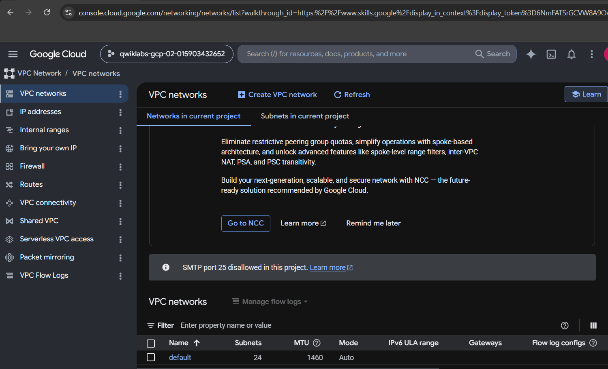

### Step 2: Viewing Default Subnets
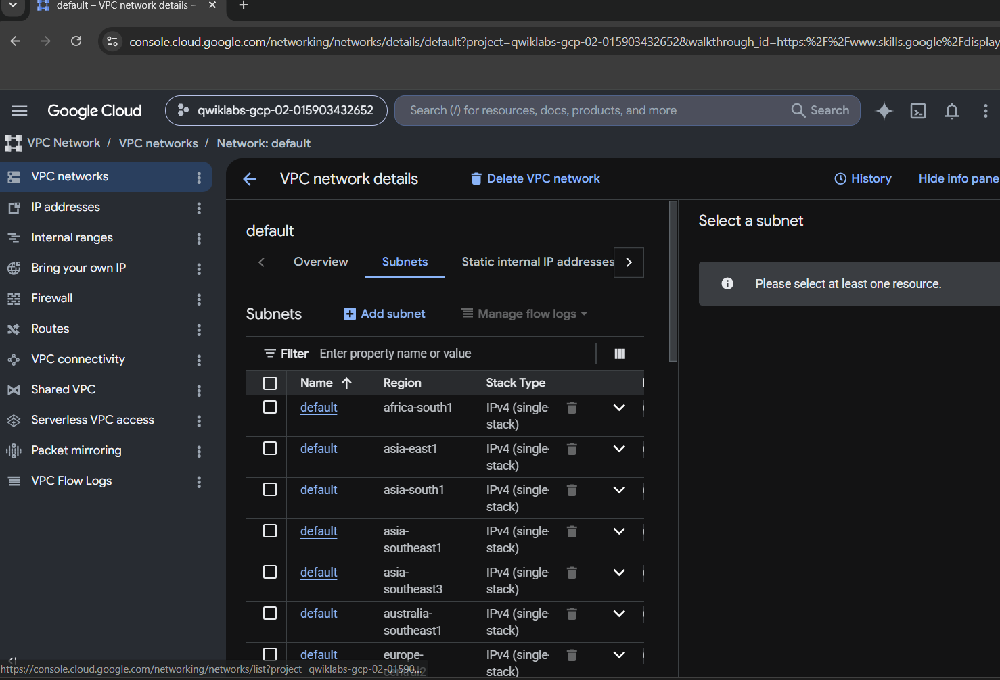

### Step 3: Exploring Routes
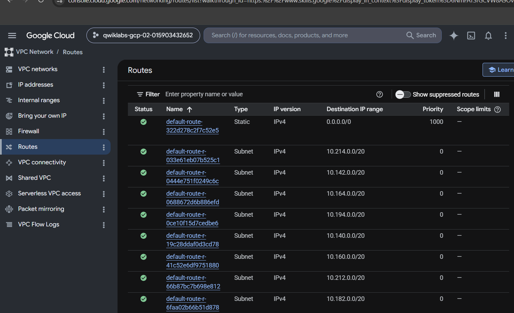

### Step 4: Viewing Firewall Rules
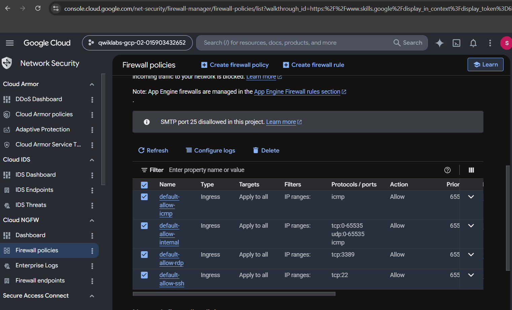

### Step 5: Deleting the Default Network
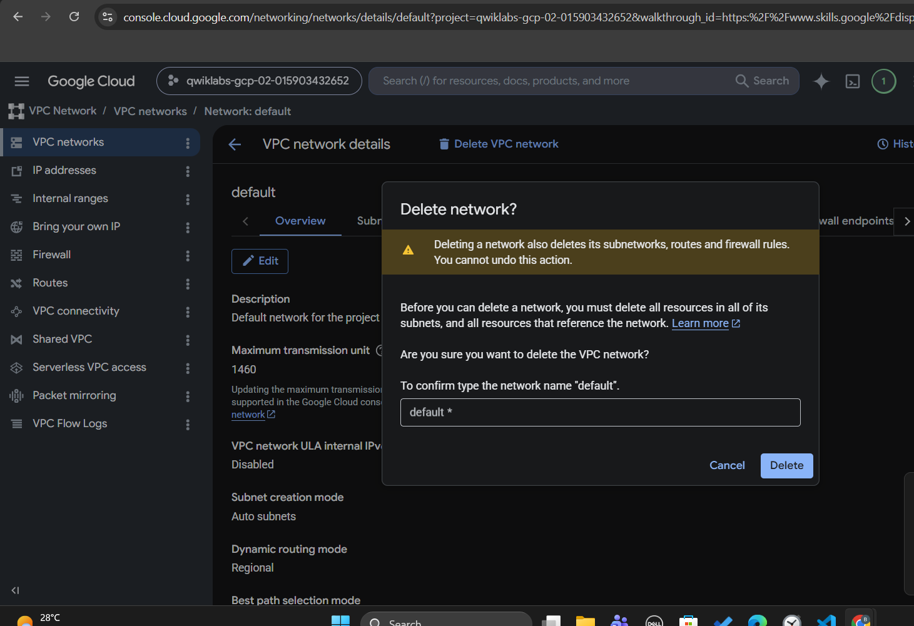

### Step 6: Creating a New Auto Mode VPC
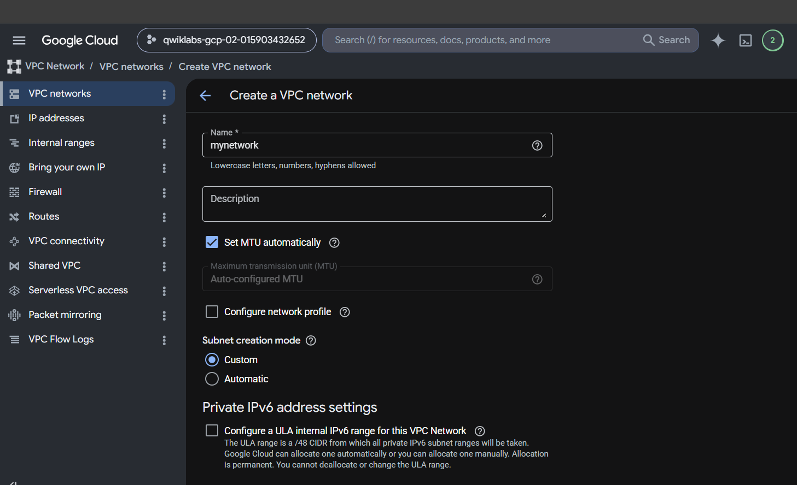

### Step 7: Configuring Firewall Rules
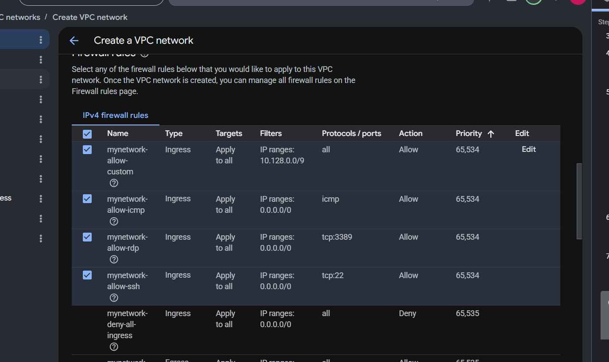

### Step 8: Newly Created VPC

### Step 9: Creating Virtual Machine Instances
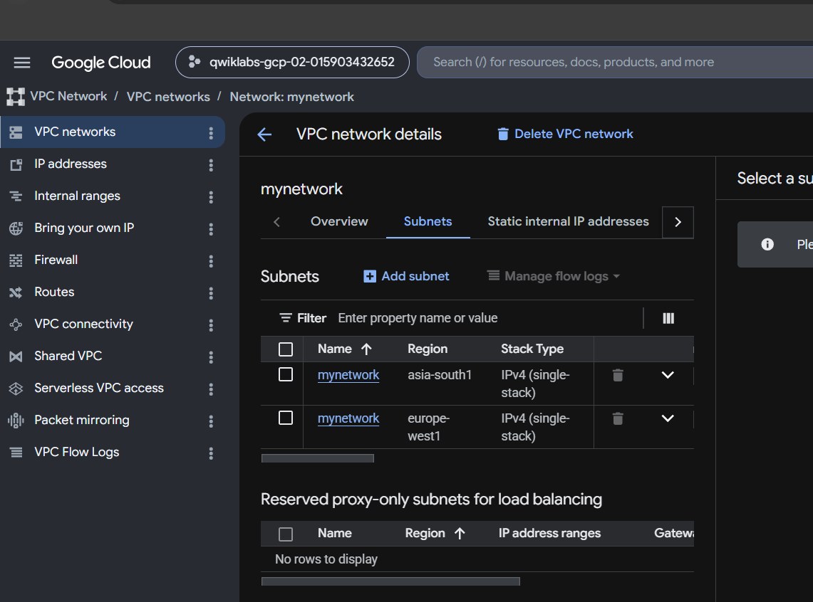

### Step 10: Virtual Machines Successfully Created
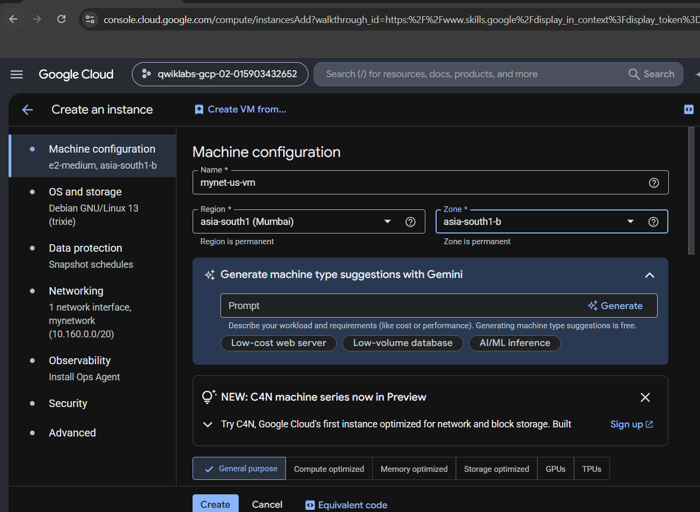

### Step 11: Connecting Using SSH
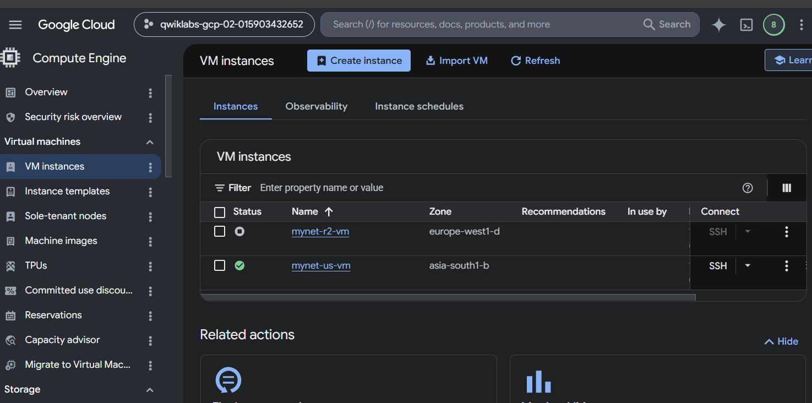

### Step 12: Connectivity Testing Using Ping
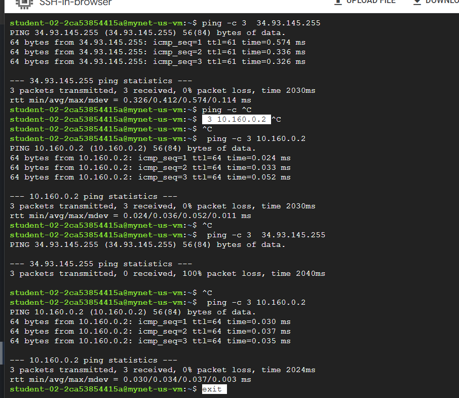

---

## 💡 Key Takeaways (Explained Simply)

### 1. What I Actually Learned Today

- Learned how Google Cloud organizes networking using VPCs.
- Explored subnets, routes, and firewall rules.
- Understood how virtual machines communicate across regions.
- Learned that firewall rules directly control network access.
- Used SSH to remotely connect to cloud virtual machines.
- Used Ping (ICMP) to verify network connectivity.

---

### 2. When do companies actually use VPC Networks?

Almost every company running workloads in Google Cloud uses VPCs.

Examples include:

- Hosting company websites
- Running application servers
- Connecting databases securely
- Building internal corporate networks
- Deploying enterprise cloud infrastructure

---

### 3. Why are Firewall Rules important?

Firewall rules help organizations:

- Prevent unauthorized access
- Protect cloud resources from attackers
- Allow only trusted traffic
- Separate internal and external communication

Without firewall rules, cloud resources would be exposed to unnecessary security risks.

---

### 4. Next Practical Steps I Want to Explore

- Create custom VPC networks with manually configured subnets.
- Learn VPC Peering between multiple networks.
- Configure Load Balancers.
- Create Cloud NAT for private virtual machines.
- Explore VPN and Hybrid Cloud networking.
- Learn advanced Google Cloud network security concepts.

---