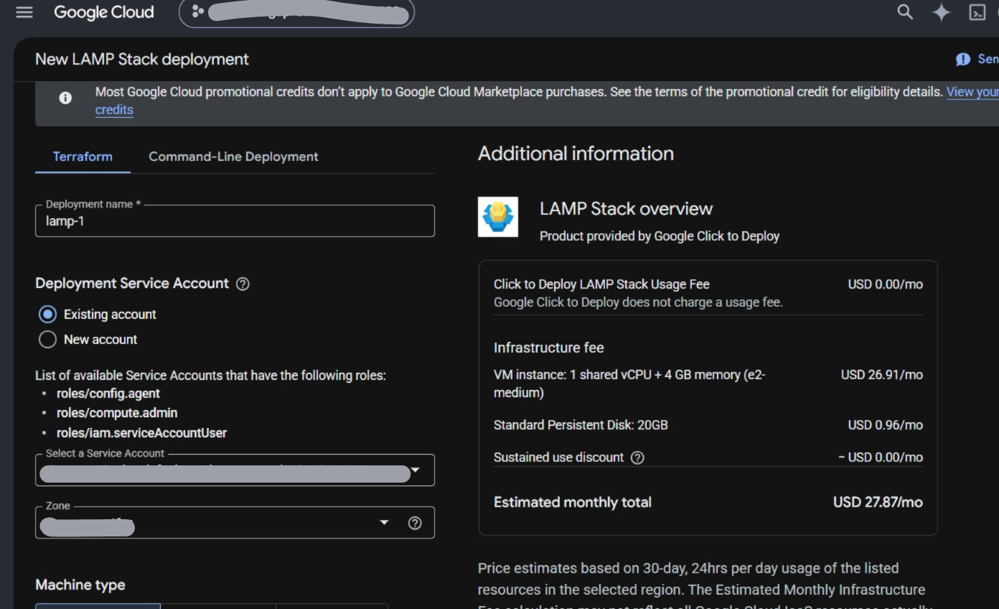
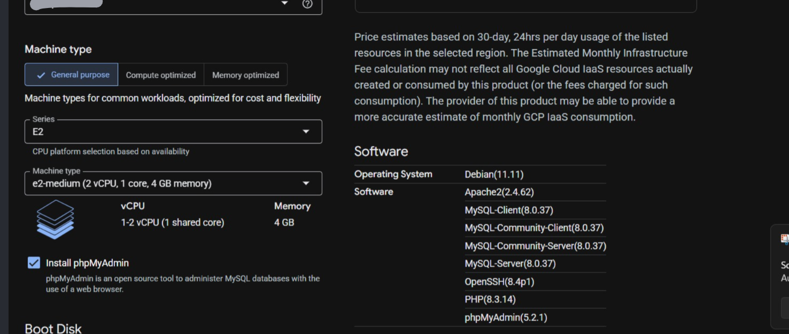
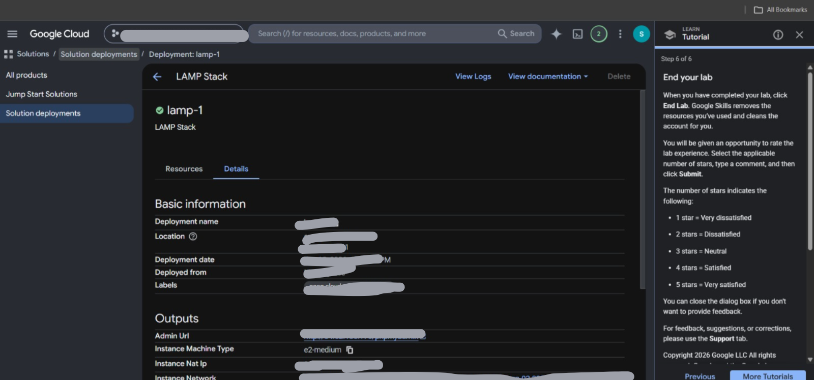
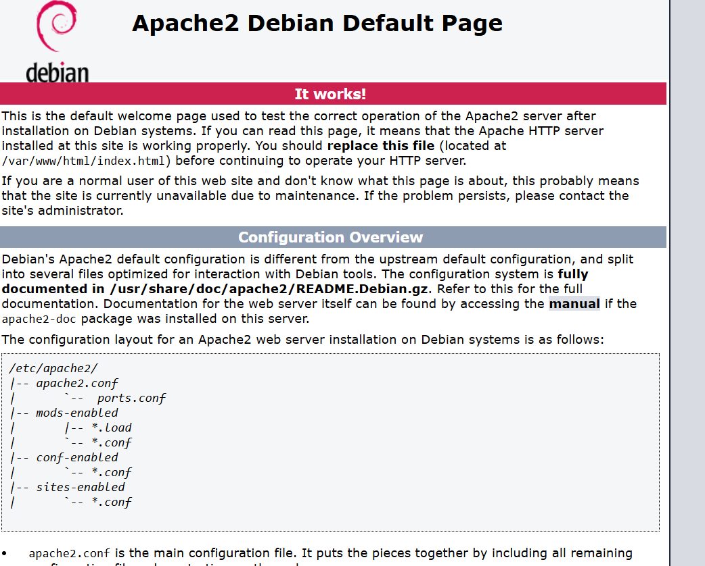

# ☁️ Lab 01: Deploying a LAMP Stack Web Server via Cloud Marketplace

## 🎯 Project Overview
In this lab, I deployed a fully functional, enterprise-grade web development environment (a **LAMP Stack**) on a Google Cloud virtual server. Instead of manually writing code and commands to install everything, I used **Google Cloud Marketplace** to automatically assemble the system in under two minutes.

---

## 🧠 Concept Breakdown (What I Actually Built)

### 1. What is a "LAMP Stack"?
Think of a LAMP stack like a fully functional **Digital Restaurant**:
*   **Linux (L)**: The foundation. This is the plot of land the restaurant is built on. It is the operating system running under the hood.
*   **Apache (A)**: The Waiter. When a user visits the website, Apache hears the request, goes to the kitchen, grabs the webpage, and serves it to the browser.
*   **MySQL (M)**: The Kitchen Pantry. This is the database where user profiles, passwords, and data are safely stored in structured tables.
*   **PHP (P)**: The Chef. This is the programming language that writes the logic. It talks to the pantry (MySQL), cooks up a dynamic webpage, and gives it to the waiter (Apache) to deliver.

### 2. What is Cloud Marketplace?
Think of this as the **App Store for Cloud Infrastructure**. Instead of an engineer writing 50 lines of complex terminal commands to install Linux, Apache, MySQL, and PHP manually, Marketplace runs automated scripts to launch them instantly with one click.

---

## 🛠️ Click-by-Click Execution Steps

### Step 1: Secure Sandbox Login
1. Opened a secure, dark **Incognito Browser Window** by right-clicking the blue console button.
2. Copied the temporary **Username** and **Password** from the lab instructions panel.
3. Pasted them into the Google login box and accepted the terms to enter the main Google Cloud Console.

### Step 2: Finding the LAMP Stack App
1. Clicked the **Navigation Menu** icon (three horizontal lines) in the top-left corner.
2. Scrolled down the list and clicked on **Marketplace**.
3. Typed **"LAMP"** into the top search bar and pressed Enter.
4. Clicked on the official search result: **"LAMP Stack, by Google Click to Deploy"**.

### Step 3: Configuring the Hardware & Deploying
1. Clicked the blue **Get Started** button, checked the agreement box, and clicked **Agree**.
2. Clicked the blue **Deploy** button.
3. Filled out the setup form with these exact settings:
    * **Zone**: Selected `[REDACTED]` (Told Google which physical data center building to use).
    * **Machine Type**: Selected **E2** as the series and **e2-medium** as the power level (2 CPUs, 4GB RAM).
    * Left all other options on default settings.
4. Scrolled to the bottom and clicked the final blue **Deploy** button.
5. Waited 2 minutes for the loading circle to finish until it said **"lamp-1 has been deployed"** with a green checkmark.

### Step 4: Finding the URL and Verifying the Server
1. On that final deployment success screen, looked at the right-hand panel titled **"Instance details"**.
2. Located the row named **"Site address"** (or Site URL) showing a blue IP address link.
3. Clicked that link, which opened a brand-new tab.
4. Verified that the screen loaded a white page with a red bar saying **"Apache2 Debian Default Page - It Works!"**.
5. Went back to the main lab instruction window and clicked the blue **"Check my progress"** button to get my 100/100 score.

----

## 📸 Visual Evidence (Sanitized Timeline)

### Step 1: Hardware Selection & Estimated Cost Configuration

### Step 2: Reviewing the Built-in LAMP Stack Specifications

### Step 3: Deployment Success & Administrative Console Details

### Step 4: Final Verification of the Live Web Server

---

## 💡 Key Takeaways (Explained Simply)

### 1. What I Actually Learned Today
*   **Speed Over Manual Work**: Instead of spending hours manually configuring a server, setting up security, and linking databases, Cloud Marketplace did it all for me instantly.
*   **Renting Power, Not Hardware**: I deployed a full web server without owning a physical machine. I simply told Google exactly how much computer power (CPUs and RAM) I needed, and they gave it to me instantly.

### 2. When do companies actually use a LAMP Stack?
You use a LAMP stack for traditional, database-heavy websites where the server has to "build" the page before showing it to the user.
*   **WordPress Sites**: 40% of the internet runs on WordPress (blogs, news sites, small business shops). WordPress requires Apache, MySQL, and PHP to work.
*   **Traditional Web Apps**: Older, established business applications that rely heavily on a relational database to hold customer information.

### 3. When would a company choose something else?
Tech has evolved, and companies don't always want to manage a whole computer server just to run code. Here is what they use instead:

*   **For simple, static websites (No Servers)**: If you just want to host a beautiful portfolio or a landing page made of pure HTML, CSS, or basic JavaScript, you don't need a LAMP stack. You can just throw the files into **Google Cloud Storage** directly, and it runs for pennies without a server.
*   **For Modern Apps (Apps that run on your phone/browser)**: Modern apps (like Netflix or Instagram) use heavy JavaScript on your device, and only call the cloud when they need to fetch data. They use specialized tools (like Node.js or Python) rather than traditional PHP.
*   **For "No-Server" Apps (Serverless)**: If a company only runs a piece of code once a day (like calculating midnight bills), they don't want a server running 24/7. They use **Cloud Functions**, where Google turns a server on for 2 seconds, runs the code, and shuts it down instantly so the company only pays for those 2 seconds.

### 4. Next Practical Steps I Want to Explore
*   Deploy an actual WordPress blog on top of this LAMP Stack.
*   Learn how to lock down the server using Google Cloud Firewall rules so hackers can't access it.
*   Watch Abhishek Veeramalla to see how to write a script that launches this automatically without clicking buttons.
